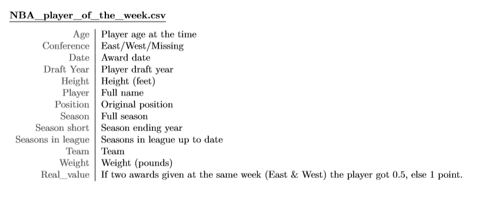

```{r setup, include=FALSE}
knitr::opts_chunk$set(echo = TRUE, eval = FALSE)
library(tidyverse)
library(infer)
templar::versions(folders = list(A = "Version A",
                                 B = "Version B",
                                 C = "Version C",
                                 solution_A = "Solutions",
                                 solution_B = "Solutions",
                                 solution_C = "Solutions"))
```

%%%
version: none

Errors are classified as:
- Data:  subject did not fully explore or understand the format of the dataset
- Statistical: inappropriate choice of test or incorrect interpretation of output
- Coding: code does not accomplish stated goal

A has many mistakes
B has some
C has none
%%%

# Data Documentation: NBA Player of the Week 1984-2018

## Context

In the National Basketball Association (NBA), games are played between Fall and Spring each year, ending with a set of playoff games and a championship.  One "season" of games thus spans two calendar years. For example, the 2019-2020 season began on October 22, 2019 and will end on April 15, 2020. The playoffs will begin on April 18, 2020, and will end with the NBA Finals in June 2020. 

Teams in the NBA are organized into two Conferences:  East and West.  From time to time, as teams change locations or new teams are added, the conferences change.

Players join the NBA by being *drafted*, typically when they are 18 years old.


## This dataset

The dataset in this exam contains information about the "Player of the Week", awarded each week to the player(s) who performed the best during that week's games. 

Each observation in this dataset represents an instance of a certain player being awarded Player of the Week.

The variables in this dataset are:



```{r, message = FALSE}
nba <-read_csv("./NBA_player_of_the_week.csv")
```

# Data Cleaning and Adjusting


%%%
version: A

## Heights and Weights

Notice that the `Height` variable sometimes has numbers, and sometimes has the letters "cm" after it.  Similarly, the `Weight` variable sometimes has the letters "kg" after it. We need to fix this to make theses variables numeric.

%%%

```{r, version = "A"}
nba <- nba %>%
  mutate(
    Height = parse_number(Height),
    Weight = parse_number(Weight)
  )
```

%%%
version: solution_A

```
Error: Just `parse_number` is used, instead of accounting for the cm to inches conversion.
class: Data
```

%%%

%%%
version: B, C

## Heights and Weights

Notice that the `Height` variable is sometimes recorded in inches ("5-9"), and sometimes recorded in centimeters ("221cm").  Similarly, the `Weight` variable is in pounds by default, but sometimes appears in kilograms. 

We need to fix these variables to be consistently in inches and in pounds.

%%%


```{r, version = c("B", "C")}

fix_height <- function(height) {
  
  # Find misrecorded heights
  is_cm <- str_detect(height, "cm")
  
  # Swap cm to inches
  height[is_cm] <- height[is_cm] %>%
    parse_number(.)*0.394
  
  # Change feet-inches to inches
  height[!is_cm] <- height[!is_cm] %>%
    str_split("-") %>%
    map_dbl(~as.numeric(.x[1])*12 +  as.numeric(.x[2]))
  
  as.numeric(height)
  
}

fix_weight <- function(weight) {
  
  # Find misrecorded weights
  is_kg <- str_detect(weight, "kg")
  
  # Swap to pounds
  weight[is_kg] <- weight[is_kg] %>%
    parse_number(.)*2.2
  
  as.numeric(weight)
  
}

```


```{r, version = c("B", "C")}
nba <- nba %>%
  mutate(
    Height = fix_height(Height),
    Weight = fix_weight(Weight)
  )
```


# Player summaries

Number of unique players who have won "Player of the Week" in the timespan covered by this dataset:

```{r}
nba %>%
  distinct(Player) %>%
  nrow()
```


The teams that have had a player win the award the most times are:

```{r}
nba %>%
  count(Team) %>%
  top_n(3, n)
```

The players that have won the Player of the Week Award the most times are:
```{r}
nba %>%
  count(Player) %>%
  top_n(3, n)
```


# Positions and size

Basketball players play in "guard" positions (PG, SG, G) or "forward" positions (F, C, F-C, FC, G-F, GF, PF, SF).  It is generally expected that forwards are much taller than guards.  We will use the players in this dataset to analyze size differences between these positions.

%%%
version: B, C

## Unique players

We need to narrow down the dataset so that each unique player only appears once.  Since heights and weights are sometimes changing over the years, we will use the median measurement for each unique player.

%%%

```{r, warning = FALSE, version = "C"}
nba <- nba %>%
  group_by(Player) %>%
  summarize(
    Height = median(as.numeric(Height), na.rm = TRUE),
    Weight = median(as.numeric(Weight), na.rm = TRUE),
    Position = Position[1])

```

```{r, warning = FALSE, version = "B"}
nba %>%
  group_by(Player) %>%
  summarize(
    Height = median(as.numeric(Height), na.rm = TRUE),
    Weight = median(as.numeric(Weight), na.rm = TRUE),
    Position = Position[1])

```

%%%
version: solution_B

```
Error: `nba` dataset isn't actually updated
class: Coding
```

%%%

%%%
version: solution_A

```
Error: Does not narrow down to unique players.
Class: Data
```

%%%

## Refactoring position variable

We will create a new variable that identifies each player as simply a Guard or a Forward.


```{r, version = "A"}
nba <- nba %>% 
  mutate(
    Position_GF = case_when(
      str_detect(Position, "G") ~ "Guard",
      TRUE ~ "Forward"
    )) 
```
%%%
version: solution_A

```
Error: This misidentifies "F-G" and "GF" as guards.
Class: Coding/Data
```

%%%


```{r, version = c("B", "C")}


nba <- nba %>% 
  mutate(
    Position_GF = fct_collapse(Position,
      Guard = c("PG", "SG", "G"),
      Forward = c("F", "C", "F-C", "FC", "G-F", "GF", "PF", "SF")
    )
  ) 

```


## Comparing Heights

The following plots show the heights and weights of players, separated by position.

```{r, version = c("B", "C")}
nba %>%
  ggplot(aes(x = Position_GF, y = Height)) +
  geom_boxplot() +
  xlab("Position")

nba %>%
  ggplot(aes(x = Position_GF, y = Weight)) +
  geom_boxplot() +
  xlab("Position")
  
```

%%%
version: B

It is clear from these boxplots that Forwards tend to be taller and weight more than Guards.  

It appears from the plots that the Forwards in the dataset have a mean height of about 81 inches, while Guards have a mean height of 75.3 inches. Forwards have a mean weight of about 245 pounds, while Guards have a mean weight of 200 pounds.

%%%

%%%
version: solution_B

```
Error: median not mean from a boxplot
Class: Statistical
```

%%%


%%%
version: C

It is clear from these boxplots that Forwards tend to be taller and weight more than Guards.  

It appears from the plots that the Forwards in the dataset have a median height of about 81 inches, while Guards have a median height of 75.3 inches. Forwards have a median weight of about 245 pounds, while Guards have a median weight of 200 pounds.

%%%


```{r, version = "A"}
nba %>%
  ggplot(aes(x = Position_GF, y = Height)) +
  geom_col() +
  xlab("Position")

nba %>%
  ggplot(aes(x = Position_GF, y = Weight)) +
  geom_col() +
  xlab("Position")
```

%%%
version: A

We find that while Forwards weigh more than Guards, Guards are taller than Forwards.

%%%


%%%
version: solution_A

```
Error:  Column plot heights are the sum of all values
Class:  Coding
```
%%%


# Different Guard positions

Among the Guard positions, there are two specialties:  Point Guard (PG) and Shooting Guard (SG).  We are interested in studying whether these positions also have a height difference.

The sample mean for each position is given below.

```{r}
nba %>%
  filter(Position %in% c("PG", "SG")) %>%
  group_by(Position) %>%
  summarize(mean(Height))
```


We will conduct a t-test at the 0.05 level.

%%%
version: A

Since it appears shooting guards are taller, our null hypothesis is that the true mean height of shooting guards is greater than the true mean height of point guards.
%%%

%%%
version: solution_A

```
Error: Should be 2-sided test, using data to form hypotheses is bad!
Class: Stats
```
%%%

```{r, version = "A"}
my_test <- 
  nba %>%
    filter(Position %in% c("PG", "SG")) %>%
    t_test(Height ~ Position,
           order = c("PG", "SG"),
           alternative = "less"
    )
```


```{r, version = c("B", "C")}
my_test <- 
  nba %>%
    filter(Position %in% c("PG", "SG")) %>%
    t_test(Height ~ Position,
           order = c("PG", "SG"),
           alternative = "two.sided"
    )
```


```{r, eval = TRUE, version = "none"}
## placeholder for inlines
my_test <- data.frame(
  statistic = 1,
  t_df = 1,
  p_value = 1
)
```


%%%
version: A

We obtain a t statistic of `r my_test$t_df`. This yields a p-value of `r my_test$p_value`.
%%%

%%%
version: solution_A

```
Error: Degrees of freedom used as t-stat
Class: Stats/Coding
```
%%%

%%%
version: B, C

We obtain a t statistic of `r my_test$t_df`. This yields a p-value of `r my_test$p_value`.
%%%

%%%
version: A, B

We fail to reject the null hypothesis, and find that there is no detectable height difference between Point Guards and Shooting Guards.
%%%

%%%
version: solution_B

```
Error: Should be rejecting, not failing!
Class: Stats
```
%%%

%%%
version: C

We reject the null hypothesis, and conclude that there is strong evidence that Shooting Guards tend to be taller than Point Guards.
%%%
